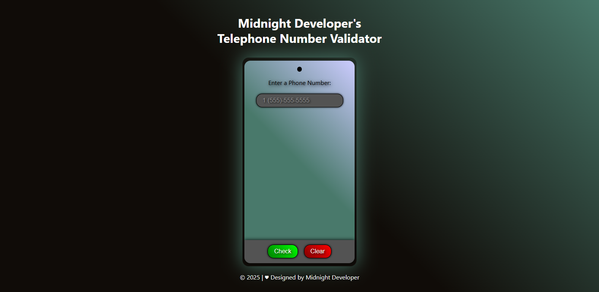

# 📱 Vynxcode's Telephone Validator

## 📖 Overview
Created as part of my FreeCodeCamp JavaScript Algorithms and Data Structures Certification, this project is a fully responsive telephone number validator built using HTML, CSS, and JavaScript.

The objective was to build a fully responsive telepone validator with logic functionality using HTML, CSS, and JavaScript that validates phone numbers with or without area codes.

Designed under my developer alias Vynxcode, the objective of this project was to validate U.S. phone numbers with or without area codes using JavaScript logic and regular expressions. The app features a visually unique, cell phone inspired interface that allows users to enter a number, validate it instantly, and receive clear feedback.

The project demonstrates structured validation logic, interactive user controls, and a responsive, accessible layout presented in a clean and polished design.

## ✨ Features
- Validates U.S. telephone numbers using JavaScript and regular expressions
- Supports phone numbers with or without country and area codes
- Clear visual feedback for valid and invalid numbers
- Scrollable results history for multiple validations
- Interactive Check and Clear buttons
- Cell phone inspired UI with custom styling and gradients
- Fully responsive layout optimized for desktop and mobile devices

## 🛠️ Built With
- HTML – structure
- CSS – styling
- JavaScript – logic and interactivity

## 🚀 How to Use
[`View Live Project`](https://vynxcode-ts.github.io/vynxcodes-telephone-number-validator/)

1. Enter a U.S. phone number into the input field.
2. Click Check to validate the number.
3. View the validation result displayed on the screen.
4. Repeat with additional numbers to see multiple results.
5. Click Clear to remove all previous validation results.

## 📞 Supported Phone Formats

`555-555-5555`
`555 555 5555`
`(555)555-5555`
`(555) 555-5555`
`5555555555`
`1 555 555 5555`
`1 (555) 555-5555`

## 🧪 Validation Rules
- Allows optional country code (1)
- Accepts numbers with or without parentheses around the area code
- Supports spaces or hyphens as separators
- Requires exactly 10 digits (or 11 with country code)
- Rejects invalid characters, incorrect digit counts, or malformed patterns

## 🧰 Skills Demonstrated
- JavaScript event handling and DOM manipulation
- Regular expressions for pattern matching and validation
- Input validation and error handling
- Responsive design using CSS Flexbox and media queries
- Custom UI styling with gradients, shadows, and hover effects
- Clean separation of structure (HTML), styling (CSS), and behavior (JavaScript)
- Accessibility conscious layout and readable feedback states

## 📂 Project Structure
vynxcodes-telephone-number-validator/ | `root folder`

│── index.html | `main webpage`

│── css/ | `styling folder`

│   └── styles.css | `styling`

│── img/ | `images folder`

│   └── website-favicon.png | `favicon`

│   └── website-preview.png | `preview image`

│── LICENSE | `license details`

│── README.md | `project details`

## 📌 Learning Goals
- Strengthen understanding of JavaScript regular expressions
- Practice building logic driven validation tools
- Improve confidence working with user input and dynamic output
- Apply responsive design principles to interactive apps
- Create a visually engaging interface while maintaining usability
- Build certification ready projects with consistent personal branding

## 🎯 Certification Compliance
This project fully meets all FreeCodeCamp JavaScript Algorithms and Data Structures 
Telephone Number Validator user stories and requirements.

## 📸 Preview

[`View Live Project`](https://vynxcode-ts.github.io/vynxcodes-telephone-number-validator/)

## 📄 License 
This project is provided for portfolio and educational review only. 
Copying, redistribution, or commercial use is prohibited. 

This project is licensed under a Vynxcode Proprietary License. 
See the [LICENSE](https://github.com/vynxcode-ts/vynxcodes-telephone-number-validator/blob/main/LICENSE) file for full terms.
